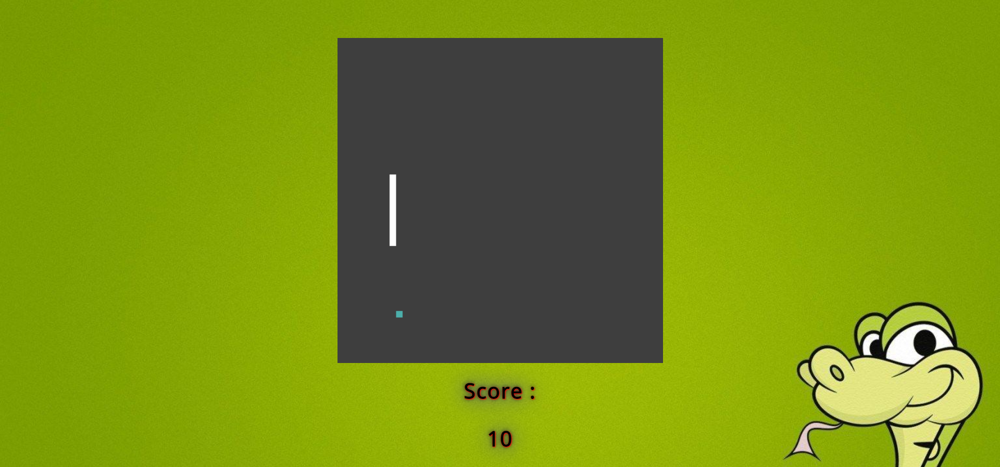

# SnakeGame

A basic game of Snake game built with [Javascript](https://github.com/topics/javascript). 
 You can play the game [here](https://zatch3301.github.io/SnakeGame/).

## Objective
Your goal is simple, you have to achieve the maximum length for your snake. 
You lose if your snake collides with itself or with the walls of the arena.

## Mechanics
As you start to play, the snake is of a small size. But, witch each pellet it eats, its size increases in length. 

## Controls
This game uses the arrow keys on the keyboard to control the Snake.

## Screenshot

Happy gaming! :)

